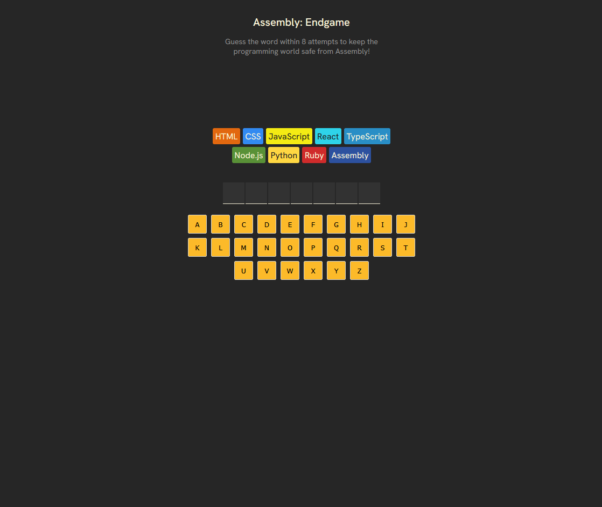

# Assembly: Endgame


[](https://assembly-endgame-teal.vercel.app/)

---

## 📚 About the Project

**Assembly: Endgame** is the final solo project from the [Scrimba React course](https://scrimba.com/). It brings together the most important concepts in React development through a fun and interactive application.

This game-like app emphasizes:

- Component-based design  
- Reusable logic with React Hooks  
- Prop/state interaction  
- JSX mastery  
- Modern UI and responsive layout  

---

## 🚀 Technologies Used

- React  
- JavaScript (ES6+)  
- HTML5 & CSS3  
- Vite   

---

## 🛠 Getting Started

```bash
git clone https://github.com/your-username/assembly-endgame.git
cd assembly-endgame
npm install
npm run dev
```

---

## 🧠 What I Learned

This project helped me practice and apply:

- Writing modular and reusable components  
- Managing state and side effects with hooks  
- Clean component structure  
- Responsive and interactive UIs  

---

## 📸 Preview



---

## 📩 Contact

Made with 💻 by [Guilherme Silva](https://github.com/guilherme-a-g-silva)
